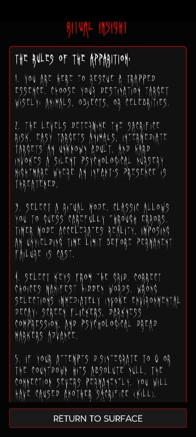
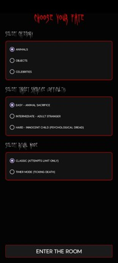
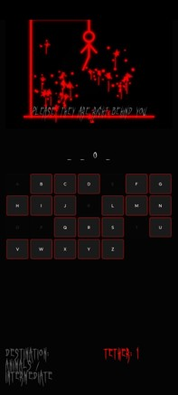

# Last Word: A Psychological Horror Hangman

> Every mistake has a consequence.

## 📱 Download

Download and install the latest Android APK from GitHub Releases.

**[⬇️ Download LAST WORD APK](https://github.com/Subhadeep-Dhar/Last-Word-Hangman-Improvised/releases/download/v1.0.0/LAST_WORD_v1.0.0.apk)**

## 📸 Screenshots

|  |  |  |  |  |
| :---: | :---: | :---: | :---: | :---: |
| **Last Word** | **Identify Yourself** | **Join the Void** | **Choose Your Fate** | **Ritual Insight** |

---

**Last Word** is a deeply atmospheric, psychological horror twist on the classic word-guessing game of Hangman. Built natively for Android, it abandons the casual, child-friendly aesthetic of traditional Hangman and replaces it with a cinematic, anxiety-inducing experience. 

Players must guess words across various categories (Animals, Objects, Celebrities) while fighting against their dwindling attempts. Every mistake inches the dynamic, blood-drawn execution closer to completion. The game actively builds tension using a custom sound engine featuring ambient dread, accelerating heartbeats, glitching UI elements, and a horrific guilt-trip narrative upon failure.

## 🩸 Key Features
* **Dynamic Canvas Execution:** A custom-drawn hangman graphic that renders stroke-by-stroke with every wrong guess.
* **Cinematic Horror UI:** Features aggressive screen flickering, layout shaking, vignette overlays, and chilling custom fonts (`Ghastly Panic`).
* **Adaptive Audio Engine:** A reactive soundscape where heartbeats accelerate and baby monitors scream as your remaining attempts drop.
* **Guilt-Inducing Narrative:** Randomized, psychological horror messages designed to make the player feel the weight of their failure.
* **Player Profiles & Stats:** Persistent local tracking of wins, losses, active categories, and total resonance scores.

## 🛠️ Technologies Used
* **Language:** Java
* **Platform:** Android SDK (Minimum API 24+)
* **UI/UX Design:** XML (ConstraintLayout, FrameLayout, GridLayout)
* **Custom Graphics:** Android `Canvas` & `Paint` APIs (used for programmatic stroke drawing of the HangmanView)
* **Animations:** Android Animation Framework (ViewPropertyAnimator, Handler loops for flickering, scaling, and camera shake effects)
* **Audio:** `MediaPlayer` (for looping ambient atmosphere) & `SoundPool` (for low-latency SFX like glitches, heartbeats, and correct/wrong chimes)
* **Data Persistence:** `SharedPreferences` (for lightweight local storage of user profiles and game statistics)
* **Build System:** Gradle
